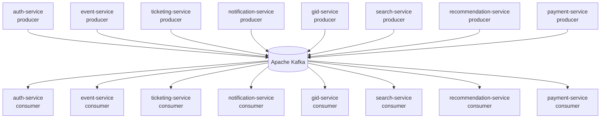

# Высокоуровневая архитектура

```mermaid
flowchart LR
    client[Mobile / Web<br/>React · Flutter]
    gateway[NGINX<br/>(API Gateway)]

    client -- HTTPS --> gateway

    prom[Prometheus]
    graf[Grafana]

    prom -.-> graf
    graf --- gateway

    subgraph "Kubernetes Cluster"
        direction TB
        auth[auth-service]
        event[event-service]
        ticket[ticketing-service]
        notify[notification-service]
        gid[gid-service]
        search[search-service]
        rec[recommendation-service]
        pay[payment-service]
    end

    gateway -- "gRPC / REST" --> auth
    gateway --> event
    gateway --> ticket
    gateway --> notify
    gateway --> gid
    gateway --> search
    gateway --> rec
    gateway --> pay

    kafka[(Apache Kafka)]
    kafka <-- "event-driven" --> auth
    kafka <-- "event-driven" --> event
    kafka <-- "event-driven" --> ticket
    kafka <-- "event-driven" --> notify
    kafka <-- "event-driven" --> gid
    kafka <-- "event-driven" --> search
    kafka <-- "event-driven" --> rec
    kafka <-- "event-driven" --> pay
```

