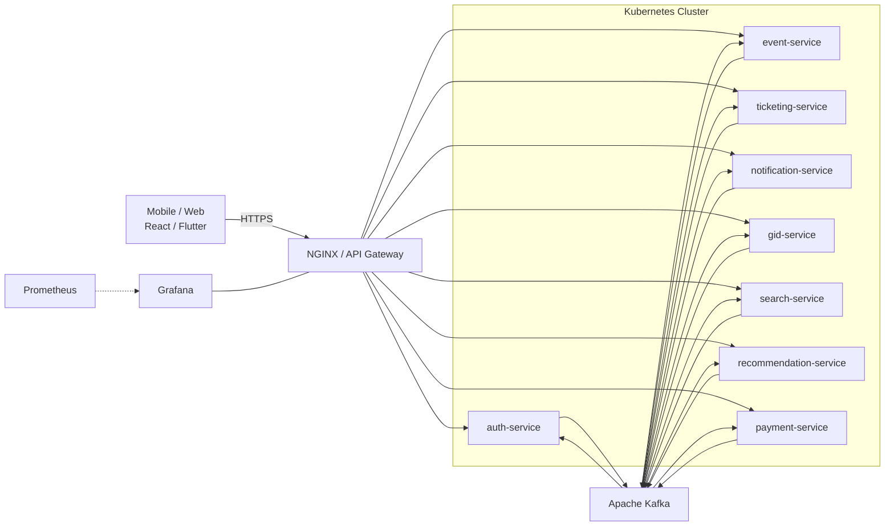
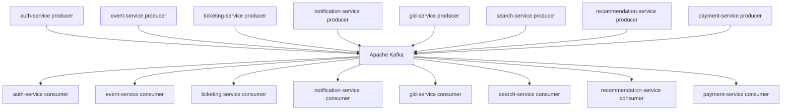
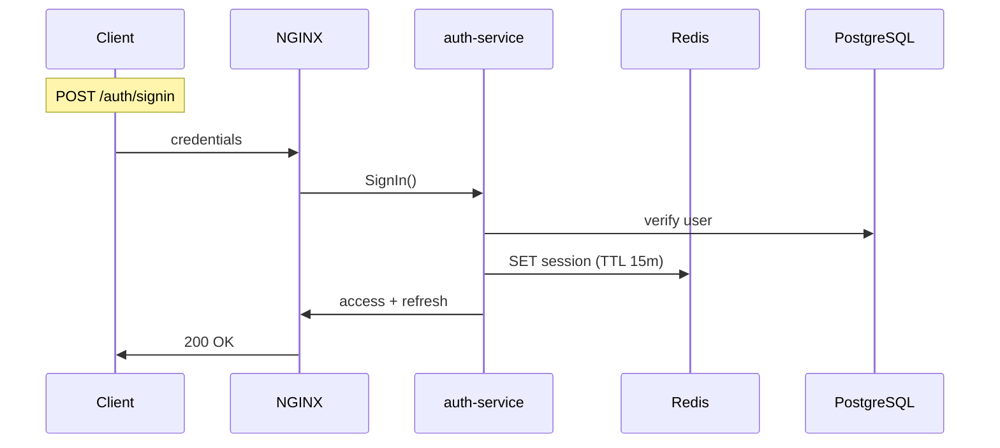
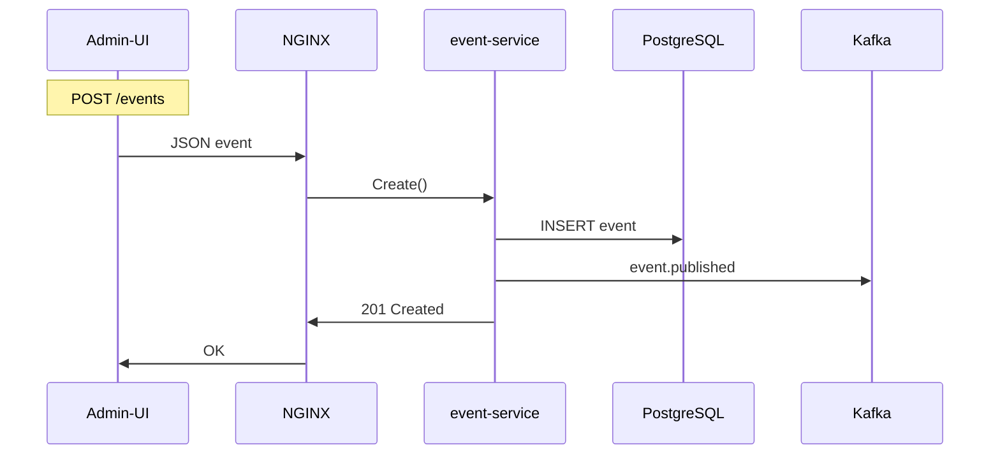

# KulturaGo — твой персональный гид в мире культуры ✨

## Оглавление

- [Ключевые возможности](#ключевые-возможности)
- [Высокоуровневая архитектура](#высокоуровневая-архитектура)
- [Стек и инфраструктура](#стек-и-инфраструктура)
- [Каталог микросервисов](#каталог-микросервисов)
- [Потоки данных и основные сценарии](#потоки-данных-и-основные-сценарии)
- [DevOps и Observability](#devops-и-observability)
- [Безопасность](#безопасность)
- [Дорожная карта](#дорожная-карта)
- [Как запустить локально](#как-запустить-локально)
- [Contributing](#contributing)
- [Лицензия](#лицензия)

---

## Ключевые возможности

| Функция                | Что получает пользователь                                  |
|------------------------|------------------------------------------------------------|
| **Онлайн-экскурсии**   | Маршруты с озвучкой экспертов в парке, музее или дома      |
| **Билеты в один клик** | Покупка без очередей на спектакли, выставки, фестивали     |
| **Умные рекомендации** | Персональные подборки «Сегодня», «На выходные», «С детьми» |
| **Гибкие фильтры**     | Бесплатные события, детские мероприятия, новое хобби       |
| **Авторские маршруты** | Нетипичные трекинги по арт-кластеру и секретным дворикам   |
| **Геймификация**       | Очки, бейджи «Исследователь района», лидерборды друзей     |
| **Сообщество**         | Отзывы, фото, советы от локальных энтузиастов              |

---

## Высокоуровневая архитектура

### Стек и инфраструктура

| Слой                | Технологии                | Назначение                           |
|---------------------|---------------------------|--------------------------------------|
| API-шлюз            | NGINX                     | TLS-termination, rate-limit          |
| Бизнес-логика       | Go 1.22                   | gRPC/REST-сервисы                    |
| ML-сервисы          | Python 3.12 + PyTorch     | TTS, рекомендации                    |
| Шина сообщений      | Apache Kafka 3.x          | Event-driven коммуникация            |
| Кэш / очереди       | Redis 7 Cluster           | Сессии, фоновые задачи               |
| База данных         | PostgreSQL 15 (+ PostGIS) | ACID-хранение, гео-запросы           |
| Объектное хранилище | S3 / MinIO                | Медиа-файлы, аватарки                |
| CI/CD               | GitHub Actions → Helm     | Канареечные и blue/green релизы      |
| Observability       | Prometheus, Loki, Tempo   | Метрики, логи, распределённые трейсы |

### Каталог микросервисов

| Сервис                 | Назначение                        | БД  | Redis | Внешние интеграции      |
|------------------------|-----------------------------------|-----|-------|-------------------------|
| auth-service           | Аутентификация, профиль, аватарки | ✔︎  | ✔︎    | —                       |
| event-service          | CRUD событий, админ-панель        | ✔︎  | ✔︎    | —                       |
| ticketing-service      | Резервы и билеты                  | ✔︎  | ✔︎    | Kassir.ru, TicketsCloud |
| gid-service            | TTS-озвучка экскурсий             | —   | ✔︎    | WebRTC                  |
| notification-service   | Push / e-mail                     | ✔︎  | ✔︎    | FCM, APNs, SMTP         |
| search-service         | Полнотекстовый поиск              | —   | —     | Meilisearch / Elastic   |
| recommendation-service | ML-подборки                       | —   | ✔︎    | —                       |
| geo-service            | POI, ETA                          | ✔︎  | —     | OpenStreetMap           |
| payment-service        | PCI-DSS контур                    | ✔︎  | ✔︎    | CloudPayments           |
| ugc-service            | Отзывы, фото                      | ✔︎  | ✔︎    | Vision API              |
| gamification-service   | Бейджи, XP                        | —   | ✔︎    | —                       |
| marketing-service      | A/B-кампании                      | ✔︎  | ✔︎    | Amplitude               |
| analytics-pipeline     | ETL в ClickHouse                  | ✔︎* | —     | Kafka Connect           |

### Дорожная карта

| Квартал | Milestone                                          |
|---------|----------------------------------------------------|
| Q1      | MVP: auth, event, ticketing, payment               |
| Q2      | gid-service, notification, search                  |
| Q3      | recommendation, gamification, UGC                  |
| Q4      | marketing-service, офлайн-режим мобильного клиента |

### Потоки данных и основные сценарии

#### Auth-service endpoints

| HTTP  | Путь                           | Описание                                        | Токен      |
|-------|--------------------------------|-------------------------------------------------|------------|
| POST  | /api/v1/auth/signup            | Регистрация нового пользователя                 | —          |
| POST  | /api/v1/auth/signin            | Логин, выдача access + refresh                  | —          |
| POST  | /api/v1/auth/refresh           | Обновление access-токена по refresh             | refresh    |
| POST  | /api/v1/auth/logout            | Инвалидация пары токенов                        | access     |
| GET   | /api/v1/me                     | Короткая карточка «Я»                           | access     |
| GET   | /api/v1/profile                | Полный профиль                                  | access     |
| PUT   | /api/v1/profile                | Сохранение профиля                              | access     |
| GET   | /api/v1/avatar/presign         | Presigned-URL для загрузки аватара в S3         | access     |

#### Event-service endpoints

| HTTP  | Путь                     | Описание                                          | Доступ                |
|-------|--------------------------|---------------------------------------------------|-----------------------|
| GET   | /api/v1/events           | Список активных событий                           | Публичный             |
| GET   | /api/v1/events/{slug}    | Детальная карточка события                        | Публичный             |
| POST  | /api/v1/events           | Создать / обновить событие (админ-панель)         | VPN + JWT «admin»     |

