# KulturaGo_Docs


## Оглавление

- [Ключевые возможности](#ключевые-возможности)
- [Высокоуровневая архитектура](#высокоуровневая-архитектура)
- [Стек и инфраструктура](#стек-и-инфраструктура)
- [Каталог микросервисов](#каталог-микросервисов)
- [Потоки данных и основные сценарии](#потоки-данных-и-основные-сценарии)
- [DevOps и Observability](#devops-и-observability)
- [Безопасность](#безопасность)
- [Что дальше?](#Что-дальше?)
- [Contributing](#contributing)
- [Лицензия](#лицензия)

---

## Ключевые возможности

| Функция                | Что получает пользователь                                  |
|------------------------|------------------------------------------------------------|
| **Онлайн-экскурсии**   | Маршруты с озвучкой экспертов в парке, музее или дома      |
| **Билеты в один клик** | Покупка без очередей на спектакли, выставки, фестивали     |
| **Умные рекомендации** | Персональные подборки «Сегодня», «На выходные», «С детьми» |
| **Гибкие фильтры**     | Бесплатные события, детские мероприятия, новое хобби       |
| **Авторские маршруты** | Нетипичные трекинги по арт-кластеру и секретным дворикам   |
| **Геймификация**       | Очки, бейджи «Исследователь района», лидерборды друзей     |
| **Сообщество**         | Отзывы, фото, советы от локальных энтузиастов              |

---

## Высокоуровневая архитектура

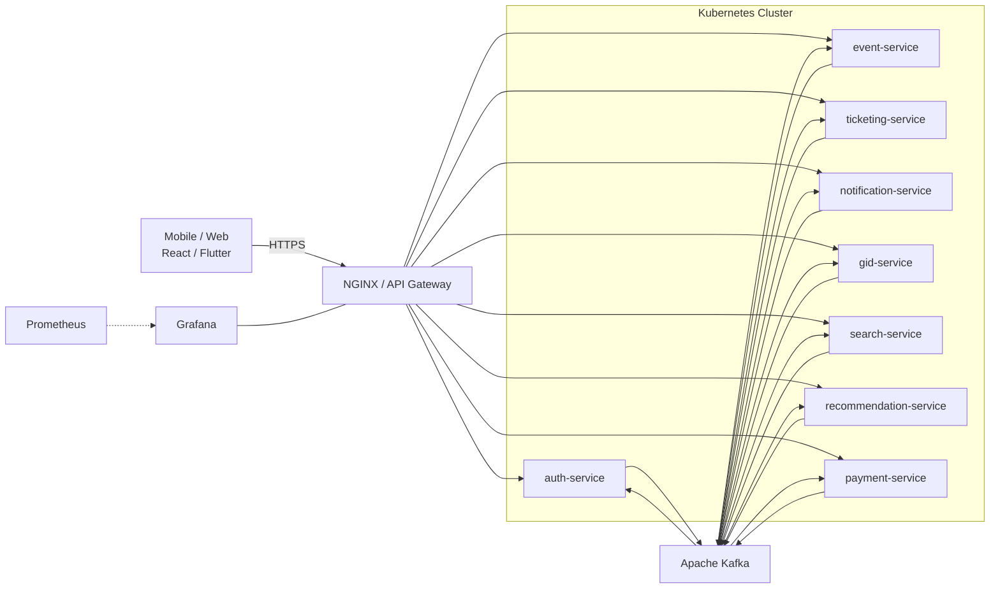

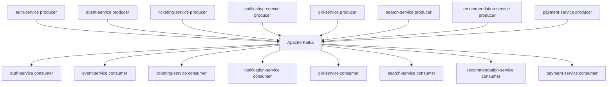

### Стек и инфраструктура

| Слой                | Технологии                | Назначение                           |
|---------------------|---------------------------|--------------------------------------|
| API-шлюз            | NGINX                     | TLS-termination, rate-limit          |
| Бизнес-логика       | Go 1.22                   | gRPC/REST-сервисы                    |
| ML-сервисы          | Python 3.12 + PyTorch     | TTS, рекомендации                    |
| Шина сообщений      | Apache Kafka 3.x          | Event-driven коммуникация            |
| Кэш / очереди       | Redis 7 Cluster           | Сессии, фоновые задачи               |
| База данных         | PostgreSQL 15 (+ PostGIS) | ACID-хранение, гео-запросы           |
| Объектное хранилище | S3 / MinIO                | Медиа-файлы, аватарки                |
| CI/CD               | GitHub Actions → Helm     | Канареечные и blue/green релизы      |
| Observability       | Prometheus, Loki, Tempo   | Метрики, логи, распределённые трейсы |


### Каталог микросервисов

| Сервис                 | Назначение                        | БД  | Redis | Внешние интеграции      |
|------------------------|-----------------------------------|-----|-------|-------------------------|
| auth-service           | Аутентификация, профиль, аватарки | ✔︎  | ✔︎    | —                       |
| event-service          | CRUD событий, админ-панель        | ✔︎  | ✔︎    | —                       |
| ticketing-service      | Резервы и билеты                  | ✔︎  | ✔︎    | Kassir.ru, TicketsCloud |
| gid-service            | TTS-озвучка экскурсий             | —   | ✔︎    | WebRTC                  |
| notification-service   | Push / e-mail                     | ✔︎  | ✔︎    | FCM, APNs, SMTP         |
| search-service         | Полнотекстовый поиск              | —   | —     | Meilisearch / Elastic   |
| recommendation-service | ML-подборки                       | —   | ✔︎    | —                       |
| geo-service            | POI, ETA                          | ✔︎  | —     | OpenStreetMap           |
| payment-service        | PCI-DSS контур                    | ✔︎  | ✔︎    | CloudPayments           |
| ugc-service            | Отзывы, фото                      | ✔︎  | ✔︎    | Vision API              |
| gamification-service   | Бейджи, XP                        | —   | ✔︎    | —                       |
| marketing-service      | A/B-кампании                      | ✔︎  | ✔︎    | Amplitude               |
| analytics-pipeline     | ETL в ClickHouse                  | ✔︎* | —     | Kafka Connect           |


### Что дальше?

| Квартал | Milestone                                          |
|---------|----------------------------------------------------|
| Q1      | MVP: auth, event, ticketing, payment               |
| Q2      | gid-service, notification, search                  |
| Q3      | recommendation, gamification, UGC                  |
| Q4      | marketing-service, офлайн-режим мобильного клиента |


## Потоки данных и основные сценарии

>[ !IMPORTANT]
>### Auth-service endpoints
>
> | HTTP  | Путь                           | Описание                                        | Токен      |
> |-------|--------------------------------|-------------------------------------------------|------------|
> | POST  | /api/v1/auth/signup            | Регистрация нового пользователя                 | —          |
> | POST  | /api/v1/auth/signin            | Логин, выдача access + refresh                  | —          |
> | POST  | /api/v1/auth/refresh           | Обновление access-токена по refresh             | refresh    |
> | POST  | /api/v1/auth/logout            | Инвалидация пары токенов                        | access     |
> | GET   | /api/v1/me                     | Короткая карточка «Я»                           | access     |
> | GET   | /api/v1/profile                | Полный профиль                                  | access     |
> | PUT   | /api/v1/profile                | Сохранение профиля                              | access     |
> | GET   | /api/v1/avatar/presign         | Presigned-URL для загрузки аватара в S3         | access     |
>
>
>| Шаг | Действие                                             | Компонент        | Примечания                                   |
>|-----|------------------------------------------------------|------------------|----------------------------------------------|
>| 1   | `GET /api/v1/profile` — получить текущие данные      | Frontend → Auth  | JWT `access` в заголовке                     |
>| 2   | `PUT /api/v1/profile` — отправить изменённые поля    | Frontend → Auth  | JSON-тело с ФИО/телефоном и другими полями   |
>| 3   | Валидация и `UPDATE users SET ...` в PostgreSQL      | auth-service     | Транзакция                                   |
>| 4   | Обновление `profile:{uid}` в Redis (TTL 15 мин)      | auth-service     |                                              |
>| 5   | Публикация события `user.updated` в Kafka            | auth-service     | Подписчики: notification, analytics          |
>| 6   | Ответ `200 OK` с новым профилем                      | Auth → Frontend  |                                              |
>
>
>#### 2. Загрузка аватара в S3 через presigned URL
>
>| Шаг | Запрос / действие                            | Компонент                  | Описание                                                                                           |
>|-----|----------------------------------------------|----------------------------|-----------------------------------------------------------------------------------------------------|
>| 1   | `GET /api/v1/avatar/presign`                 | Frontend → Auth            | Требуется JWT `access`                                                                              |
>| 2   | Генерация `objectKey` + presigned-URL (PUT)  | auth-service               | `objectKey = sha256(email:login:ts).jpg`; TTL URL = 15 мин; сохранение `pending_avatar_key` в Redis |
>| 3   | `{url, objectKey, expires}` → клиенту        | Auth → Frontend            |                                                                                                     |
>| 4   | `PUT url` (загрузка файла)                   | Frontend → S3              | Заголовки `Content-Type`, `x-amz-acl: private`                                                      |
>| 5   | `PUT /api/v1/profile { "avatar": objectKey}` | Frontend → Auth            |                                                                                                     |
>| 6   | Проверка key в Redis → `UPDATE users.avatar` | auth-service               | Удаление `pending_avatar_key`; запись в Redis-кеш; событие `user.updated`                           |
>| 7   | Push/e-mail о смене аватара                  | notification-service       |                                                                                                     |
>
>**Формула ключа:**
>
>```
>objectKey = sha256(email + “:” + login + “:” + unixNano()) + “.jpg”
>```
>
>#### Загрузка аватара
>
>```mermaid
>sequenceDiagram
>    autonumber
>    participant UI  as Frontend
>    participant G   as NGINX
>    participant A   as auth-service
>    participant R   as Redis
>    participant DB  as PostgreSQL
>    participant S3  as S3 Bucket
>    participant K   as Kafka
>
>    Note over UI: User clicks "Change avatar"
>
>    UI->>G: GET /avatar/presign (JWT)
>    G->>A: presign()
>    A->>R: SET pending:{uid}=objectKey (EX 600)
>    A->>A: generate presigned URL
>    A->>G: {url, objectKey}
>    G->>UI: 200 OK
>
>   UI->>S3: PUT file (presigned URL)
>    S3-->>UI: 200 OK
>
>    UI->>G: PUT /profile {avatar: objectKey}
>    G->>A: SaveProfile()
>    A->>R: GET pending:{uid}
>    A->>DB: UPDATE users SET avatar=objectKey
>    A->>R: DEL pending:{uid}
>    A->>K: user.updated
>    A->>G: 200 OK
>    G->>UI: 200 OK
>```

#### Как работает сам сервис

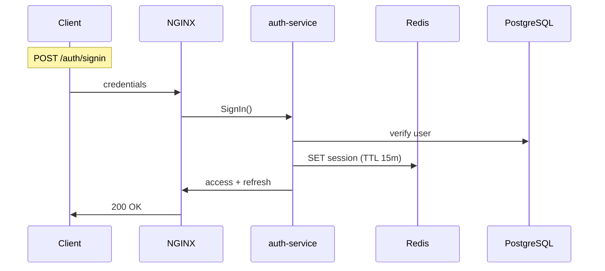

### Event-service endpoints

| HTTP  | Путь                     | Описание                                          | Доступ                |
|-------|--------------------------|---------------------------------------------------|-----------------------|
| GET   | /api/v1/events           | Список активных событий                           | Публичный             |
| GET   | /api/v1/events/{slug}    | Детальная карточка события                        | Публичный             |
| POST  | /api/v1/events           | Создать / обновить событие (админ-панель)         | VPN + JWT «admin»     |

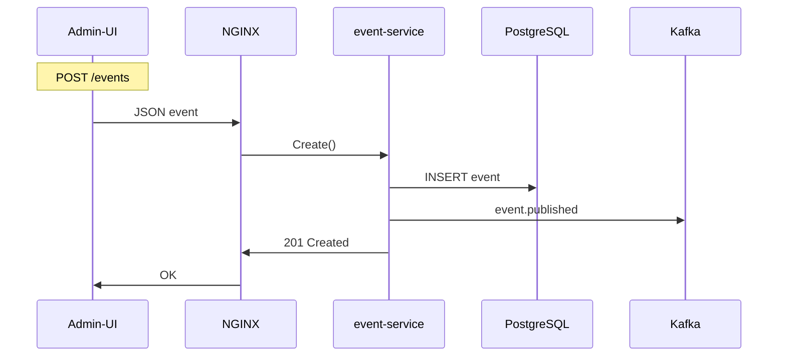

## Ticketing-service

Бронирование мест, оформление заказов, получение билетов.

### Endpoints

| HTTP | Путь                                 | Описание                         |
|------|--------------------------------------|----------------------------------|
| POST | `/api/v1/tickets/purchase`           | Создать заказ, резерв мест       |
| GET  | `/api/v1/tickets/{id}`               | Детали заказа / билета           |
| GET  | `/api/v1/tickets/{id}/qr`            | Скачать QR-код                   |
| POST | `/api/v1/tickets/cancel`             | Отменить заказ (если не оплачен) |
| POST | `/internal/tickets/callback`         | Webhook платёжного провайдера    |


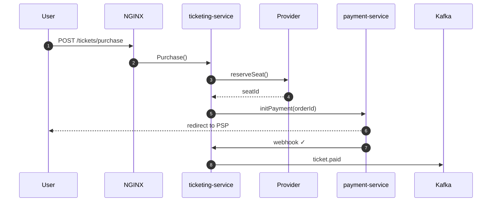

## Gid-service


| HTTP | Путь                 | Описание              |
|------|----------------------|-----------------------|
| POST | `internal/tts/speak` | Генерировать TTS-файл |
| WS   | `/ws/tour/{tourId}`  | Live-стрим экскурсии  |

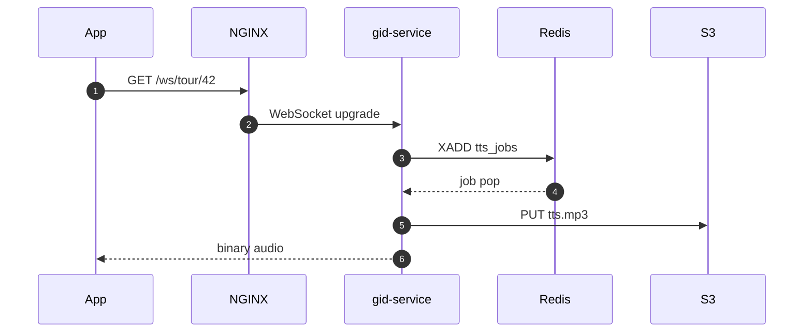


## Notification-service

| HTTP | Путь       | Описание             |
|------|------------|----------------------|
| gRPC | `Notify()` | Внутренний вызов     |
| GET  | `/healthz` | readiness / liveness |

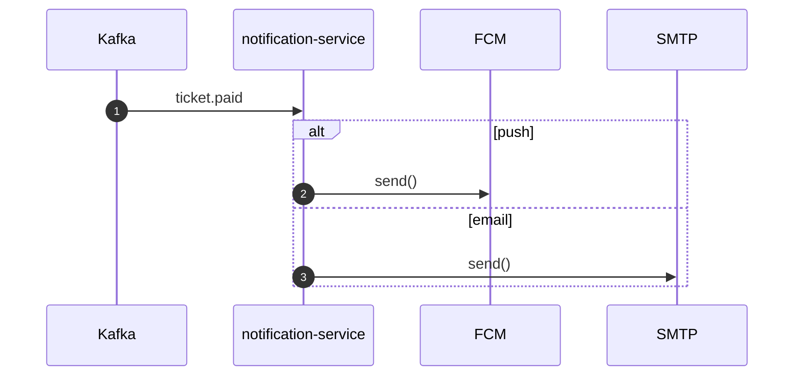

## Search-service

| HTTP | Путь             | Описание                          |
|------|------------------|-----------------------------------|
| GET  | `/api/v1/search` | Поиск: q, filters, page, per_page |

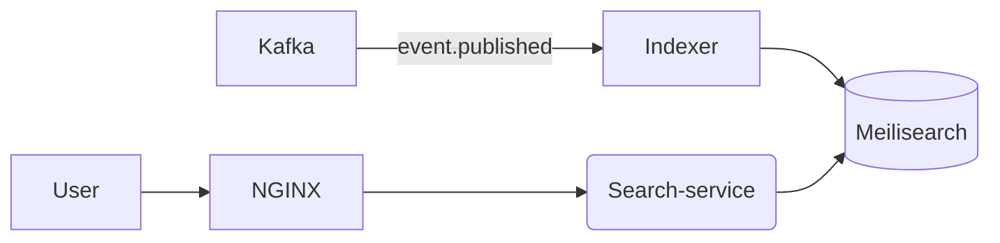

# Recommendation-service

| HTTP | Путь                                      | Описание                 |
|------|-------------------------------------------|--------------------------|
| GET  | `/api/v1/recommendations`                 | Топ-N рекомендаций (uid) |
| GET  | `/api/v1/recommendations/similar/{event}` | Похожие события          |

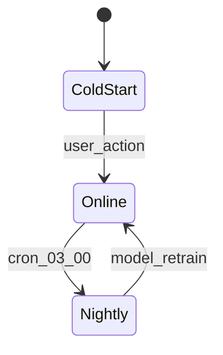

## Geo-service

| HTTP | Путь                 | Описание                    |
|------|----------------------|-----------------------------|
| GET  | `/api/v1/geo/nearby` | POI рядом (lat,lon,radius)  |
| GET  | `/api/v1/geo/eta`    | ETA между точками (from,to) |

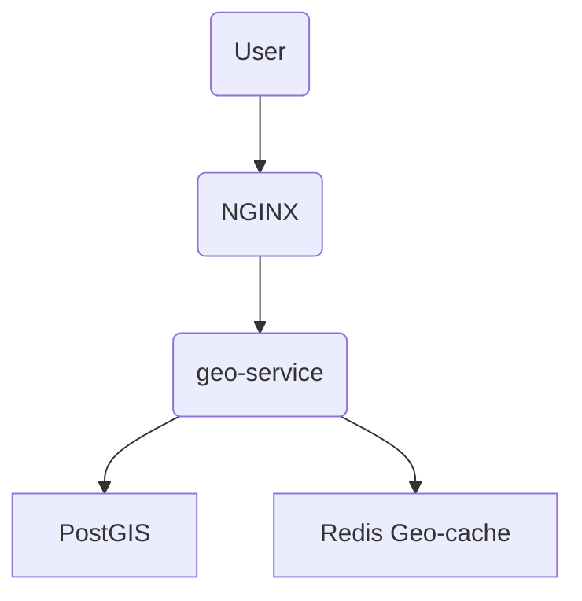

## Payment-service

| HTTP | Путь                                   | Описание                             |
|------|----------------------------------------|--------------------------------------|
| POST | `/internal/pay`                        | Создать платёж (ticketing → payment) |
| POST | `/api/v1/payments/callback/{provider}` | Webhook от платёжного провайдера     |

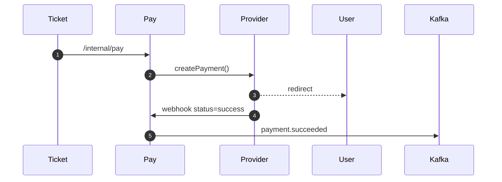

## Ugc-service

Отзывы, оценки и пользовательские фотографии.

| HTTP   | Путь                     | Описание                                    |
|--------|--------------------------|---------------------------------------------|
| POST   | /api/v1/reviews          | Создать отзыв или оценку                    |
| GET    | /api/v1/reviews          | Список отзывов (`event`, `page`)            |
| DELETE | /api/v1/reviews/{id}     | Удалить собственный отзыв                   |

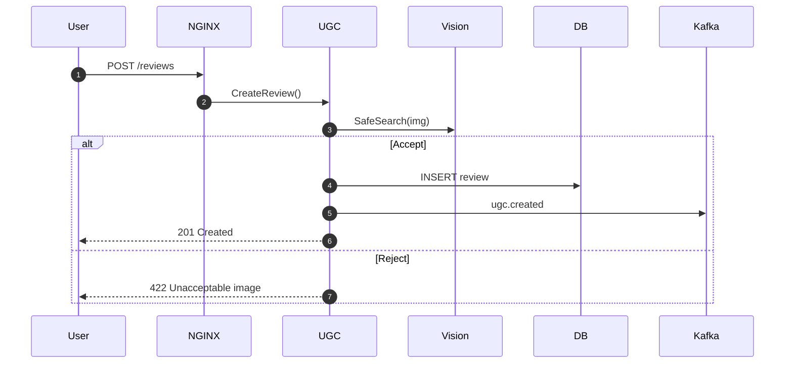

## Gamification-service

XP-система, уровни, бейджи и лидерборды.

| HTTP | Путь                  | Описание                    |
|------|-----------------------|-----------------------------|
| GET  | `/api/v1/xp`          | Текущие XP и уровень игрока |
| GET  | `/api/v1/leaderboard` | ТОП-N пользователей         |

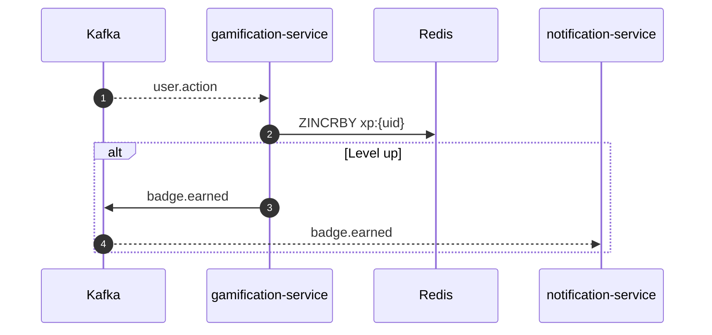


## Marketing-service

Сервис отвечает за создание A/B-экспериментов, сегментацию аудиторий и запуск триггерных push-кампаний.

| HTTP | Путь                      | Описание                             |
|------|---------------------------|--------------------------------------|
| POST | `/admin/campaigns`        | Создать или запустить кампанию       |
| GET  | `/admin/campaigns/{id}`   | Получить статус кампании             |
| GET  | `/admin/experiments/{id}` | Статус A/B-эксперимента              |
| POST | `/admin/segments`         | Создать сегмент пользователей        |

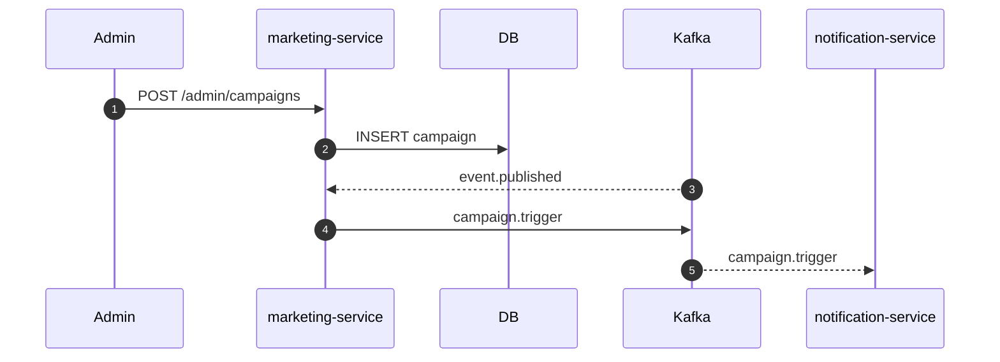